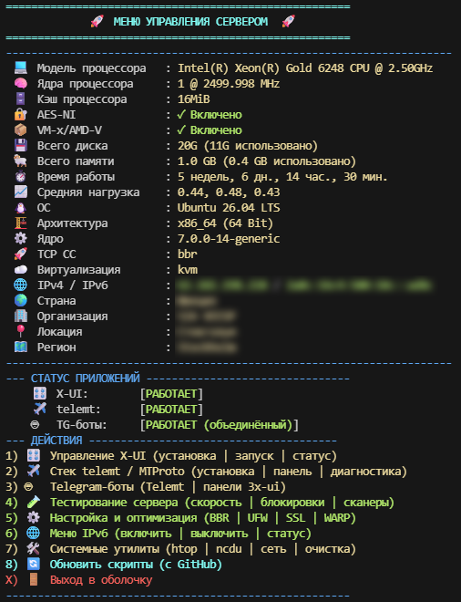

# 🚀 VSM — VPS Server Menu

Консольное меню для управления VPS: прокси, Telegram-боты, сеть, диагностика. Вместо десятков команд — один экран.



## Установка

```bash
bash <(curl -sL https://raw.githubusercontent.com/adkudryashov/VSM/main/install.sh)
```

Дальше запуск командой `vsm`. Обновление — пункт **8** в меню. Удаление:

```bash
bash <(curl -sL https://raw.githubusercontent.com/adkudryashov/VSM/main/uninstall.sh)
```

**Требования:** Ubuntu 20.04+, root, установленные `git` и `curl`. Остальное меню доставит само. Для X-UI Pro апстрим дополнительно требует Ubuntu 24.04/26.04 или Debian 12/13.

## Возможности

| # | Раздел | Что умеет |
|---|---|---|
| **1** | **X-UI Pro** | Установка [3x-ui-pro](https://github.com/mozaroc/3x-ui-pro) — VLESS/Reality/Trojan через nginx с автоSSL и Clash-подпиской. Патч без потери БД, AdGuard Home, бэкап и восстановление |
| **2** | **Стек telemt / MTProto** | MTProto-прокси для Telegram, веб-панель telemt_panel, лимитер входящих соединений, современный TLS |
| **3** | **Telegram-боты** | Боты мониторинга Telemt и панелей 3x-ui — вместе или по отдельности |
| **4** | **Диагностика** | Проверка доступности сервисов, замеры скорости, YABS, IPQuality, сетевые сканеры |
| **5** | **Настройка сервера** | BBR, запрет ICMP, UFW, часовой пояс, SSL-сертификаты, Cloudflare WARP |
| **6** | **IPv6** | Включение и отключение на уровне ядра, проверка адресов |
| **7** | **Утилиты** | htop, ncdu, nethogs, ping/mtr, активные порты, очистка системы, проверка привязки домена |
| **8** | **Обновление** | `git pull`, пересоздание ссылок и перезапуск ботов — без перезагрузки сервера |

Главный экран показывает характеристики сервера, геолокацию и статусы X-UI, telemt и ботов.

### Стек telemt / MTProto — пункт 2

| Пункт | Что делает |
|---|---|
| Установить весь стек с нуля | 3x-ui-pro + telemt + telemt_panel. **Стирает существующую панель**, требует ввода слова подтверждения |
| Добавить telemt к существующей 3x-ui-pro | Ставит только telemt и панель, базу 3x-ui не трогает |
| Статус и диагностика | Проверка служб и целостности конфигурации, сквозной тест работоспособности |
| Восстановить конфигурацию | Пересоздаёт vhost nginx из сохранённых настроек |
| Показать учётные данные | Читает `/etc/vsm/telemt-credentials.txt` (права 600) |
| Управление службами | Статус, старт, стоп, логи telemt и telemt_panel |
| MTProxyL | Ставит и запускает [лимитер, обход и тюнинг](https://github.com/Liafanx/MTProxyL): nftables, Zapret2, sysctl, фиксы для iOS. Нужен его режим **Reanimator** — он применяет фиксы к уже работающему telemt, а не ставит свой. Показывает версии и выбранный режим |
| Пересборка nginx с OpenSSL 3.5 | Сборка со свежим OpenSSL, 20–40 минут |
| Удалить стек | Убирает telemt и панель; 3x-ui-pro и сертификаты не трогает |

Стеку нужны два поддомена с A-записями на IP сервера — меню спросит их при установке и проверит конфигурацию само.

> **После патча или переустановки панели** прогоните «Статус и диагностика»: установщик 3x-ui-pro перезаписывает конфигурацию nginx.

> Пересборка nginx замораживает пакет (`apt-mark hold`) — security-обновления придётся ставить вручную, повторив пересборку.

### Telegram-боты — пункт 3

| Вариант | Служба | Для чего |
|---|---|---|
| **Объединённый** | `3xui-telemt-bot` | Обе функции в одном чате с переключением по кнопкам и общей сводкой |
| telemt-bot | `telemt-bot` | Только панель Telemt |
| 3xui-bot | `3xui-monitor` | Только панели 3x-ui |

**telemt-часть:** статистика панели, история подключений по IP, отчёты, метрики Prometheus, карта подключений по GeoIP.
**3x-ui часть:** статусы и отчёты по панелям, добавление и удаление панелей из чата, уведомления о падении и об истечении срока VPS.

Установщик спрашивает только токен от [@BotFather](https://t.me/BotFather), Telegram ID администраторов и домен для карты. Остальное делает сам: окружение, зависимости, базы GeoIP, systemd-юниты, `location` в nginx с бэкапом и проверкой конфига.

> Объединённый и отдельные боты **взаимоисключающие** — установщик снимает лишние службы, иначе два процесса дублируют сбор данных. Данные общие, при переключении режима ничего не теряется.

> Токены и базы в репозиторий не попадают. Обновление кода — пункт **5** внутри меню ботов.

Архитектура, устройство клавиатуры и структура кода — в [bots/README.md](bots/README.md).

## 🤝 Благодарности и используемые компоненты

Этот проект был бы невозможен без огромного количества замечательных инструментов от Open Source сообщества и поддержки профильных ресурсов. Выражаю огромную благодарность авторам следующих проектов, которые интегрированы в данное меню:

### 📢 Сообщество и идеи
* **[Комьюнити ITDog]** — за предоставленные скрипты проверки, ценные обсуждения, тесты и неоценимый вклад в развитие свободного интернета в РФ. Вы лучшие! 🐕

### 🛡️ Прокси и маршрутизация
* **[3x-ui-pro](https://github.com/mozaroc/3x-ui-pro)** от *mozaroc* — автоматическая установка панели 3x-ui с nginx, SSL, Clash-подпиской и диагностикой сети.
* **[3x-ui](https://github.com/MHSanaei/3x-ui)** от *MHSanaei* — базовая многофункциональная панель управления, на которой построен 3x-ui-pro.
* **[telemt](https://github.com/telemt/telemt)** — MTProto-прокси для Telegram на Rust.
* **[telemt_panel](https://github.com/amirotin/telemt_panel)** от *amirotin* — веб-панель мониторинга и управления telemt.
* **[MTProxyL](https://github.com/Liafanx/MTProxyL)** от *Liafanx* — SYN-лимитер на nftables, обход Zapret2, тюнинг sysctl и фиксы для iOS под Telemt.
* **[MTproxy-reanimation](https://github.com/Liafanx/MTproxy-reanimation)** от *Liafanx* — предыдущее поколение того же инструмента, заброшено автором на 1.2.9. Меню предупредит, если его следы остались на сервере.
* **[MTPROTO_FIX_By_MEKO](https://github.com/Mekotofeuka/MTPROTO_FIX_By_MEKO)** от *Mekotofeuka* — iptables SYN-фикс, самое первое поколение.

### 🕵️‍♂️ Анализ блокировок и сети
* **[Censorcheck](https://github.com/Nokola-Tesla/censorcheck)** от *Nikola Tesla* ([@tracerlab](https://t.me/tracerlab)) — проверка доступности из РФ: DNS, датацентры и радар ТСПУ в домашних сетях. Запускается напрямую с `censorcheck.tlab.pw`.
* **[IP Region](https://github.com/vernette/ipregion)** от *vernette* — определение принадлежности IP.
* **[RealiTLScanner](https://github.com/XTLS/RealiTLScanner)** от *XTLS* и база **[GeoIP](https://github.com/Loyalsoldier/geoip)** от *Loyalsoldier* — продвинутый сканер для поиска SNI.
* **[DPI Detector](https://github.com/Runnin4ik/dpi-detector)** от *Runnin4ik* — утилита для глубокого анализа цензуры трафика в РФ.
* **[SNI Scan](https://github.com/dewil/sni-scan)** от *dewil* — удобный Python-скрипт для сканирования подсетей на доступность SNI.

### 📊 Бенчмарки и тесты сервера
* **[YABS (Yet Another Bench Script)](https://github.com/masonr/yet-another-bench-script)** от *masonr* — один из лучших комплексных тестов производительности (CPU, RAM, Disk, Network).
* **[bench.sh](https://bench.sh/)** от *teddysun* — классический скрипт для вывода характеристик сервера и проверки скорости сети.
* **[IPQuality](https://github.com/xykt/IPQuality)** от *xykt* — отличный инструмент для проверки IP сервера на блокировки и флаги со стороны зарубежных сервисов.

## 📝 Лицензия
Проект распространяется по лицензии MIT. Вы можете свободно использовать, изменять и распространять этот код.
